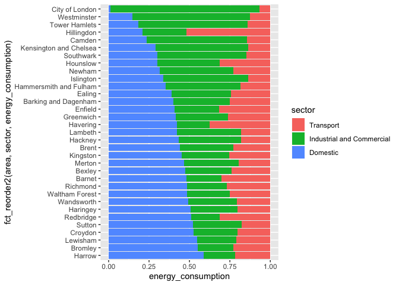
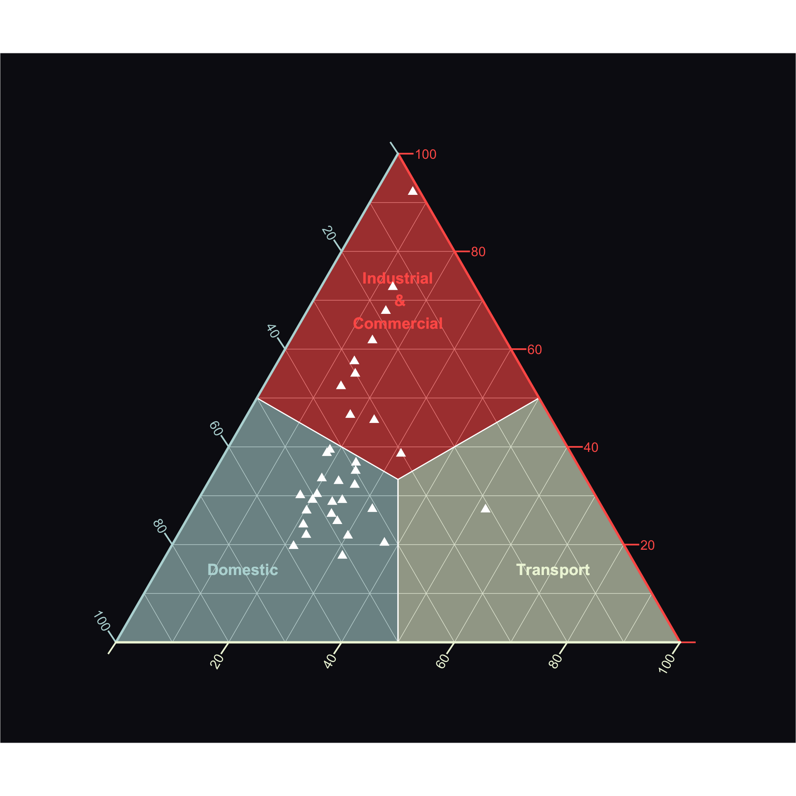
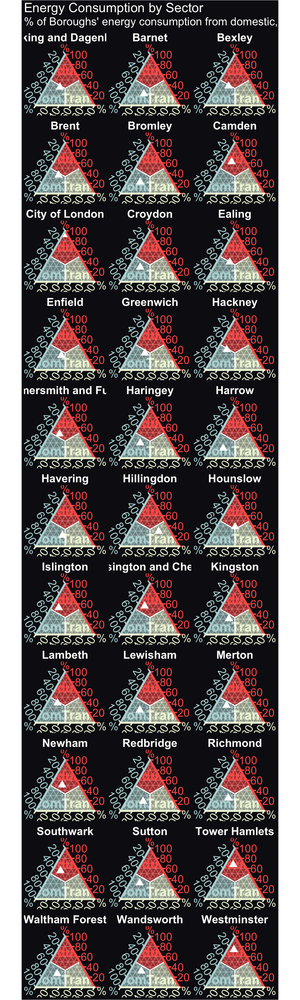

Using Ternary Plots to Visualise London’s Energy Consumption
================

``` r
library(tidyverse)
```

    ## ── Attaching packages ─────────────────────────────────────────────────────────────────────────── tidyverse 1.3.0 ──

    ## ✓ ggplot2 3.2.1     ✓ purrr   0.3.3
    ## ✓ tibble  2.1.3     ✓ dplyr   0.8.3
    ## ✓ tidyr   1.0.0     ✓ stringr 1.4.0
    ## ✓ readr   1.3.1     ✓ forcats 0.4.0

    ## ── Conflicts ────────────────────────────────────────────────────────────────────────────── tidyverse_conflicts() ──
    ## x dplyr::filter() masks stats::filter()
    ## x dplyr::lag()    masks stats::lag()

``` r
energy <- read_csv(
  "https://data.london.gov.uk/download/leggi/2d6ee3f1-e928-48a9-8eab-01748c65ac6f/energy-consumption-borough-leggi.csv")
```

    ## Parsed with column specification:
    ## cols(
    ##   Area = col_character(),
    ##   LEGGI_Year = col_double(),
    ##   Sector = col_character(),
    ##   Fuel = col_character(),
    ##   Data_Year = col_character(),
    ##   kWh = col_character()
    ## )

``` r
energy <- energy %>% janitor::clean_names()

energy$k_wh <- as.numeric(energy$k_wh)
```

    ## Warning: NAs introduced by coercion

``` r
energy_summarised <- energy %>% 
  filter(leggi_year == 2016, sector != "Total", area != "Unapportioned", area != "London") %>% 
  group_by(area, sector) %>% 
  summarise(energy_consumption = sum(k_wh)) %>% 
  ungroup()

energy_summarised %>% 
  group_by(area) %>% 
  mutate(energy_consumption = energy_consumption/sum(energy_consumption)) %>% 
  mutate(sector = fct_reorder(sector, energy_consumption)) %>% 
  ggplot(aes(fct_reorder2(area, sector, energy_consumption), energy_consumption)) + 
  geom_col(aes(fill = sector), position = "fill") +
  coord_flip()
```

<!-- -->

``` r
library(ggtern)
library(JLLify)

# devtools::install_github("OwnKng/JLLify")

energy_tern <-energy_summarised %>% 
  spread(sector, value = energy_consumption)

ggtern_base(x_label = "Domestic", y_label = "Industrial\n &\nCommercial", z_label = "Transport", 
            x_color = "#B8D8D8", y_color = "#FE5F55", z_color = "#EEF5DB") +
  geom_point(data = energy_tern, aes(Domestic, `Industrial and Commercial`, Transport), 
             shape = 17, size = 6, color = "white") + 
  theme_ternary_dark(x_color = "#B8D8D8", y_color = "#FE5F55", z_color = "#EEF5DB") + 
  labs(x = "", y = "", z = "")
```

    ## Warning: Ignoring unknown aesthetics: z

<!-- -->

    ## Warning: Ignoring unknown aesthetics: z

<!-- -->
