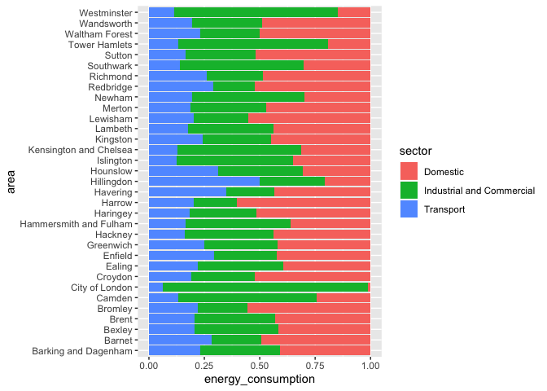
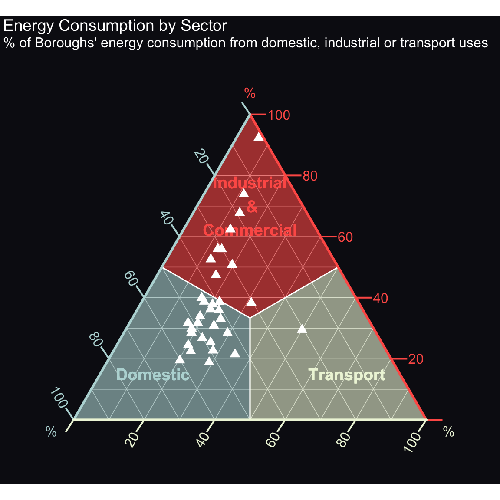
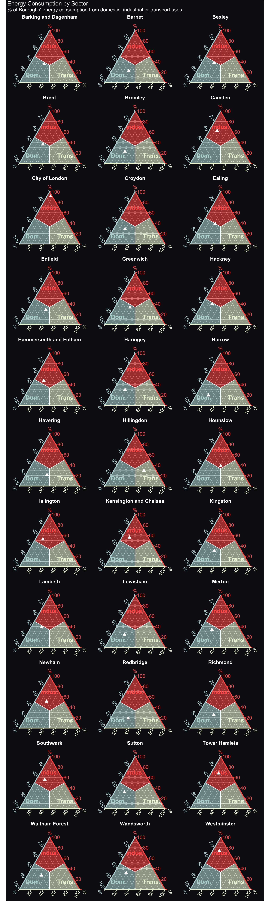

Using Ternary Plots to Visualise London’s Energy Consumption
================

This post shows how ternary plots can be both an communicative and
beautiful form of data visualisation. To create the ternary plot, we’ll
use the ggtern package (see <http://www.ggtern.com/> for more info), as
well as a function from my own JLLify package (see here:
<https://github.com/OwnKng/JLLify>) to style the plots.

### The Data

The data we’re using comes the London Energy and Greenhouse Gas
Inventory (LEGGI). This is a record of greenhouse gas emissions and
energy consumption from homes, workplaces and transport within the
Greater London area. It is published every year, though the most recent
record we have is from 2017. Here, we will look at energy consumption
only.

``` r
library(tidyverse)

energy <- read_csv(
  "https://data.london.gov.uk/download/leggi/2d6ee3f1-e928-48a9-8eab-01748c65ac6f/energy-consumption-borough-leggi.csv")

energy <- energy %>% janitor::clean_names()
energy <- energy %>% mutate_at(vars(k_wh, data_year), as.numeric)
```

As the data contains three major means sources of energy use, we can
easily summarise what share each use represents for every London
borough.

``` r
energy_summarised <- energy %>% 
  filter(leggi_year == 2017, sector != "Total", 
         area != "Unapportioned", 
         area != "London") %>% 
  group_by(area, sector) %>% 
  summarise(energy_consumption = sum(k_wh)) %>% 
  ungroup() %>% 
  group_by(area) %>% 
  mutate(energy_consumption = energy_consumption/sum(energy_consumption)) 

energy_summarised
```

    ## # A tibble: 99 x 3
    ## # Groups:   area [33]
    ##    area                 sector                    energy_consumption
    ##    <chr>                <chr>                                  <dbl>
    ##  1 Barking and Dagenham Domestic                               0.409
    ##  2 Barking and Dagenham Industrial and Commercial              0.359
    ##  3 Barking and Dagenham Transport                              0.232
    ##  4 Barnet               Domestic                               0.491
    ##  5 Barnet               Industrial and Commercial              0.227
    ##  6 Barnet               Transport                              0.282
    ##  7 Bexley               Domestic                               0.417
    ##  8 Bexley               Industrial and Commercial              0.378
    ##  9 Bexley               Transport                              0.204
    ## 10 Brent                Domestic                               0.431
    ## # … with 89 more rows

### Visualising the Data

We can pipe the summarised data into a ggplot command to produce a
rather standard filled column graph.

``` r
energy_summarised %>% 
  ggplot(aes(area, energy_consumption)) + 
  geom_col(aes(fill = sector), position = "fill") +
  coord_flip()
```

<!-- -->

### Using a Ternary Plot

Where we have three categories in our data, ternary plots are a good
alternative to the standard column graphs. Using a ternary plot, we can
see which share each category of energy consumption represents. It’s
also perhaps easier to see whether there’s a general trend in our data
than with a column graph - e.g. does domestic energy consumption
represent the main source of energy consumption across the London
boroughs?

The ggtern package is an extension to ggplot that enables the creation
of ternary charts. As these plots have three axes, they can be difficult
to read correctly. To remedy this, I’ve developed some light touch
functions that handle the aesthetic styling of a ternary plot - applying
axes colouring, shading certain zones and adding labels, etc. These
functions are available in the JLLify package, which can be installed
via github.

``` r
library(ggtern)

# devtools::install_github("OwnKng/JLLify")
library(JLLify)

energy_tern <-energy_summarised %>% 
  spread(sector, value = energy_consumption)

ggtern_base(x_label = "Domestic", 
            y_label = "Industrial\n &\nCommercial", 
            z_label = "Transport", 
            x_color = "#B8D8D8", 
            y_color = "#FE5F55", 
            z_color = "#EEF5DB") +
  geom_point(data = energy_tern, aes(Domestic, `Industrial and Commercial`, Transport), 
             shape = 17, size = 6, color = "white") + 
  theme_ternary_dark(x_color = "#B8D8D8", y_color = "#FE5F55", z_color = "#EEF5DB") + 
  labs(x = "%", y = "%", z = "%", 
       title = "Energy Consumption by Sector", 
       subtitle = 
         "% of Boroughs' energy consumption from domestic, industrial or transport uses")
```

<!-- -->

From this plot, we can see that in around two-thirds of London boroughs,
domestic consumption accounts for the largest share of energy
consumption. Industrial and commercial consumption accounts for the
majority of energy usage in the other third. In one London borough -
Hillingdon, where Heathrow Airport is located - transport represents
about 50% of energy consumption.

While this plot is useful for looking at the overall trend in the data,
what it lacks is the ability to look at the distribution in each London
borough (unlike the column graph). We can resolve this by faceting the
visualisation, generating a longer, info-graphic style plot.

From this plot, we can easilly pick out the London boroughs for which
industrial and commercial applications represent a higher share of
energy usage - Westminster, Camden, the City.

<!-- -->
